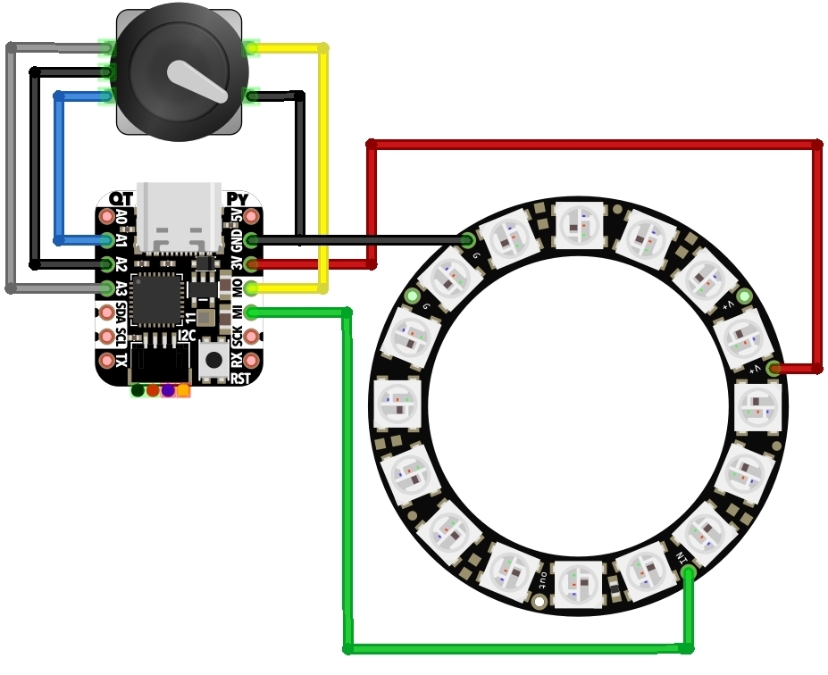

# QTPy-Knob

QT Py USB Media Knob using rotary encoder & neopixel
ring. Modified to use 15 mm shaft length encoder.

The QTPy-Knob features:
- Media knob for volume up/down/mute with "qtpy-knob.py" CircuitPython program
- Stylish design reminiscent of Griffin Powermate
- Recessed USB-C connector to for safety
- No screws needed for assembly
- Only 3 wires needed to solder (none if you want to forgo LED lighting)
- Reprogrammable for any USB macro key action via CircuitPython

A small video about it: https://www.youtube.com/watch?v=pt7JgoSlgOg

This is an attempt to make a minimal and easy-to-build version of
similar, previous projects like:

- https://learn.adafruit.com/trinket-usb-volume-knob

- https://learn.adafruit.com/media-dial

## Components

Parts needed:

- [Adafruit QT
  Py](https://elmwoodelectronics.ca/products/adafruit-qt-py-samd21-dev-board-with-stemma-qt)
  (https://www.adafruit.com/product/4600). A [Seeeduino
  XIAO](https://www.seeedstudio.com/Seeeduino-XIAO-Arduino-Microcontroller-SAMD21-Cortex-M0+-p-4426.html)
  will also work.
  
- [NeoPixel Ring - 16 x WS2812 5050 RGB
  LED](https://elmwoodelectronics.ca/products/neopixel-ring-16-x-ws2812-5050-rgb-led-with-integrated-drivers)
  (https://www.adafruit.com/product/1463)
  
- [Rotary
  Encoder](https://elmwoodelectronics.ca/products/rotary-encoder-extras)
  (https://www.adafruit.com/product/377, PEC11-4215F-S24 or
  equivalent)
  
- 3D printed enclosure (see "cad" folder). There are now 3mf project files which should work with most slicing software:

  1. **qtpyknob-all-mod.3mf** - all the parts, for printing in a translucent material
  2. **qtpyknob-diffuser-mod.3mf** - just the diffuser, for printing in a translucent material
  3. **qtpyknob-except-diffuser-mod.3mf** - all the other parts, if you want to print the body in an opaque material

Optional:

- [Little Rubber Bumper
  Feet](https://elmwoodelectronics.ca/products/little-rubber-bumper-feet-pack-of-4)
  (https://www.adafruit.com/product/550 or equivalent). Helps the
  device stay in place on the desk.

## Software

Software installation consists of:

- Install CircuitPython on the QT Py

- Install required CircuitPython libraries to QT Py

- Copy qtpy_knob.py to QT Py

The CircuitPython installation step is described here: https://learn.adafruit.com/welcome-to-circuitpython/installing-circuitpython

The last two steps can be accomplished with the below

    git clone https://github.com/todbot/qtpy-knob
    cd qtpy-knob
    pip3 install circup
    circup install -r requirements.txt
    cp qtpy_knob.py /Volumes/CIRCUITPY/code.py

### Variations

There are a few variations of the code provided:

- `qtpy_knob_scroller.py` -- performs scrolling instead of volume knob

- `qtpy_knob_simple.py` -- no neopixel stuff, just encoder and USB sending

- `qtpy_knob_midi_cc.py` -- sends MIDI CC instead of keyboard/mouse

## Assembly

Steps:

1. Plug rotary encoder to bottom of QT Py. If your encoder has metal
on the bottom, add a bit of tape (Kapton, Scotch, electrical) in
between the QT Py and the encoder.  If your encoder has mounting tabs,
cut them off.  Solder the five pins:

  - 3 pins go in A1, A2, A3
  - 2 pins go in M0 and GND

  

2. Print out the enclosure on your 3d printer. Standard 0.2mm at 20%
  infill is fine. Make sure to use the `mod` versions of the knob and
  diffuser STLs: the others don't fit this encoder. The STL files are:

  - `qtpyknob-base.stl` -- Base that houses the QT Py & rotary encoder
  - `qtpyknob-basecap.stl` -- Cap that goes on the bottom of the base
  - `qtpyknob-knob-mod.stl` -- Knob that you turn
  - `qtpyknob-diffuser-mod.stl` -- Light diffuser that goes between base
  & knob, should be printed with translucent or clear plastic. Or you
  can leave it out. Or you can approximate it with a disk cut out
  clear plastic like a CD case. 

Use the rotary encoder's washer & screw to hold QTPy+encoder assembly

  

3. Solder three wires to the Neopixel ring, insert the ring into the enclosure and solder the wires to the 3V, Gnd, and MI pins of the QT Py.  Use a bit of hot glue to secure the Neopixel ring if it doesn't snap in.

  

4. Snap the bottom cap on and the knob top on and you're done with physical assembly!

  

### Wiring diagram

### Assembly animation

## Useful links

Resources that helped me out on this:

- https://learn.adafruit.com/media-dial
- https://learn.adafruit.com/make-it-a-keyboard/circuitpython
- https://github.com/adafruit/Adafruit_CircuitPython_HID/tree/master/examples
- https://circuitpython.readthedocs.io/projects/hid/en/latest/api.html#adafruit-hid-consumer-control-consumercontrol
- https://learn.adafruit.com/trinket-usb-volume-knob

Original blog post by the designer: [QTPy-knob: Simple USB knob w/ CircuitPython – todbot blog](https://todbot.com/blog/2021/02/25/qtpy-knob-simple-usb-knob-w-circuitpython/)
